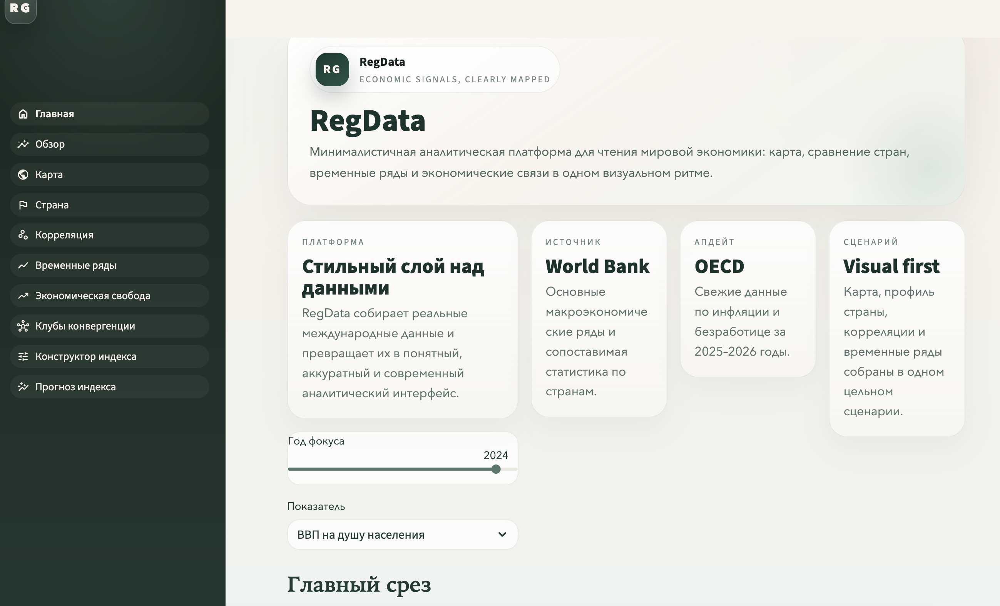
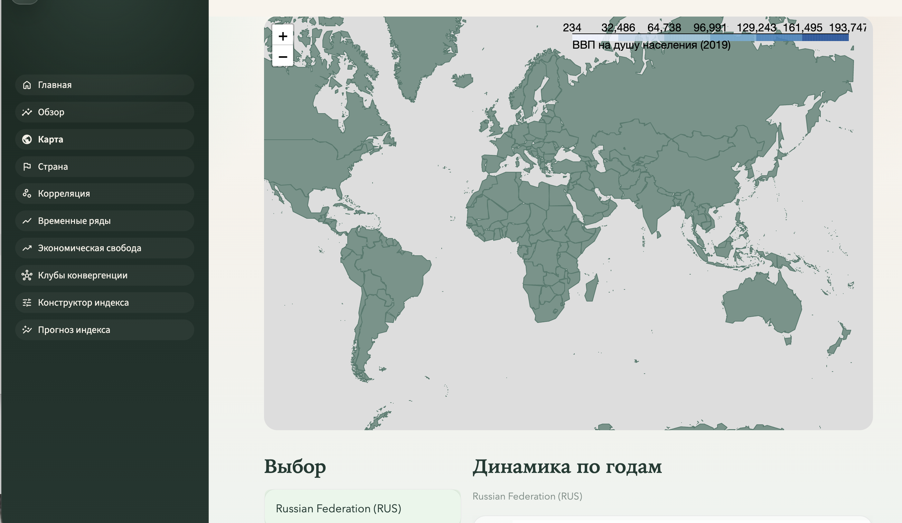
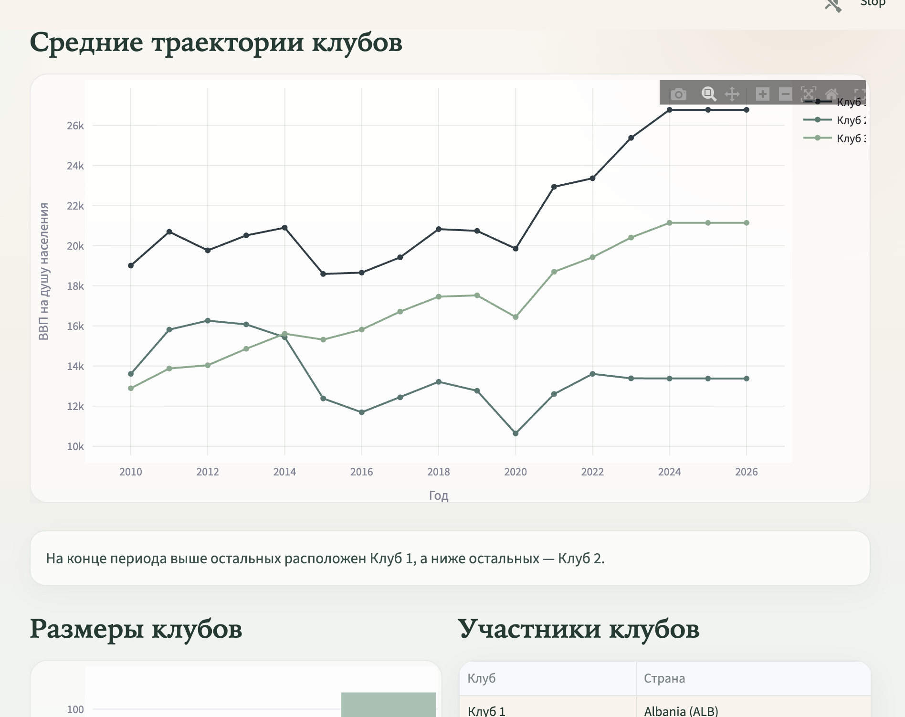
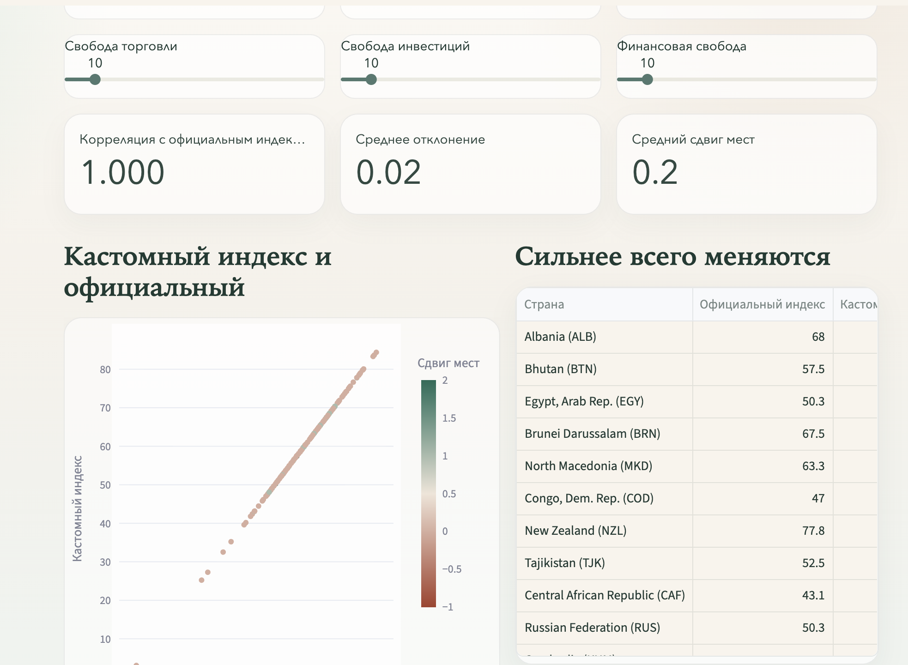
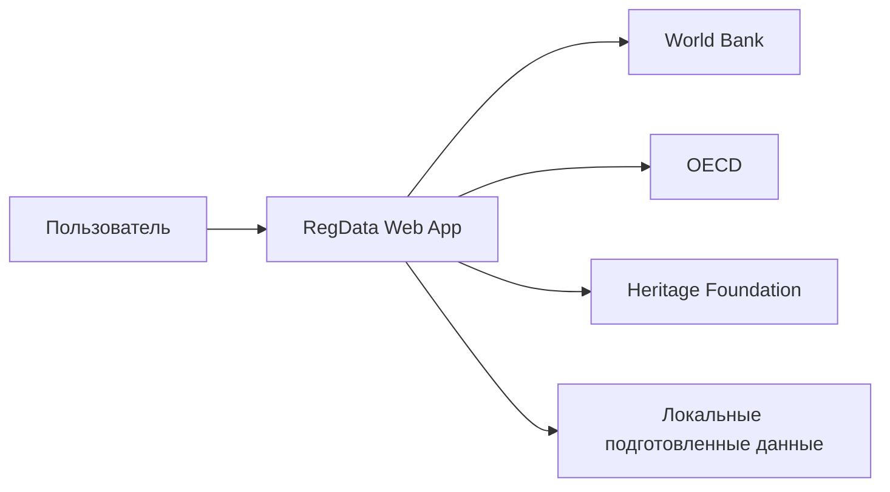
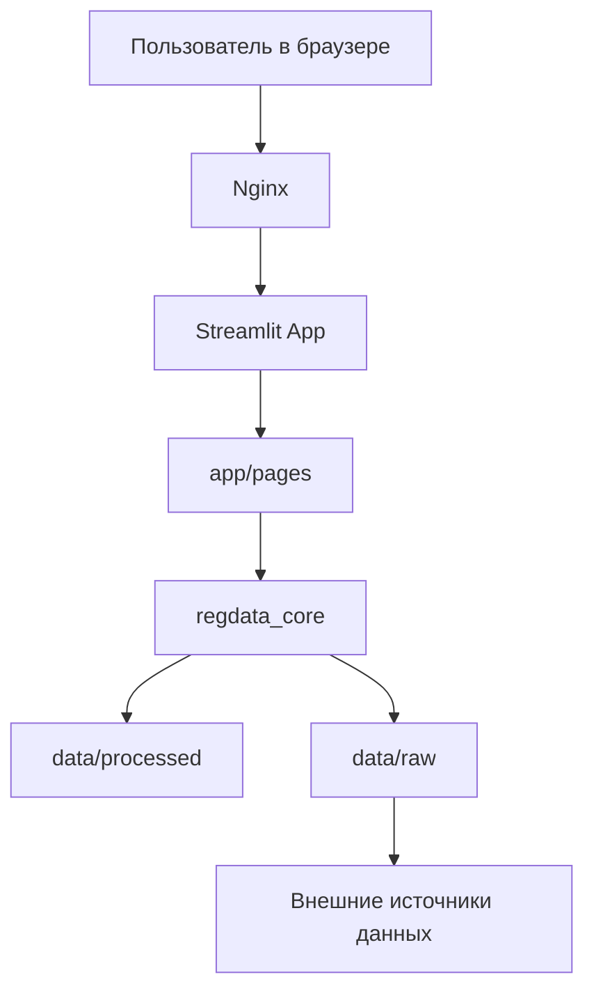
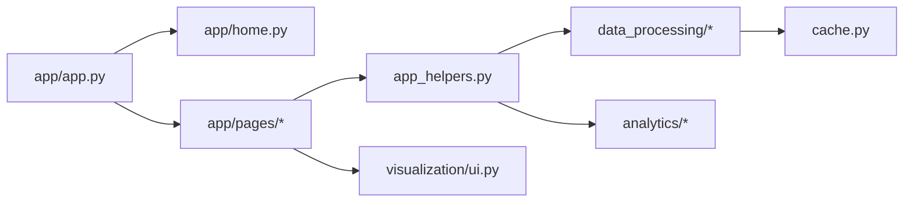

# RegData - Economic Freedom Visualizer

### Оглавление
- [О проекте](#о-проекте)
- [Для пользователя](#для-пользователя)
- [Для разработчика](#для-разработчика)
- [Архитектура проекта](#архитектура-проекта)
- [Источники данных](#источники-данных)
- [Функциональные возможности](#функциональные-возможности)
- [Техническая реализация](#техническая-реализация)
- [Установка и запуск](#установка-и-запуск)
- [Научная значимость](#научная-значимость)
- [Практическое применение](#практическое-применение)

## О проекте

**RegData** - это интерактивная аналитическая платформа для исследования взаимосвязей между экономической свободой и базовыми макроэкономическими показателями стран мира. Проект объединяет данные из нескольких международных источников и показывает их в одном понятном веб-интерфейсе.

Это не просто набор графиков. Приложение позволяет:
- сравнивать страны между собой;
- смотреть мировую картину по выбранному показателю;
- изучать динамику индекса экономической свободы;
- анализировать временные ряды;
- собирать собственную версию индекса на основе весов компонент;
- строить простой прогноз по последним наблюдениям.

Главная идея проекта - сделать макроэкономические данные и индекс экономической свободы наглядными, сопоставимыми и удобными для анализа даже для пользователя, который не хочет вручную работать с таблицами и сырыми датасетами.

## Для пользователя

### Зачем использовать RegData

Если хочется быстро понять, как страны отличаются по инфляции, безработице, ВВП на душу населения и экономической свободе, RegData закрывает эту задачу в одном месте. Пользователю не нужно искать показатели по разным сайтам, скачивать таблицы и самостоятельно приводить данные к единому формату.

Приложение особенно удобно для:
- учебных исследований;
- подготовки презентаций и докладов;
- межстрановых сравнений;
- первичного экономического анализа;
- наглядной демонстрации того, как меняется индекс при смене весов компонент.

### Что можно делать в приложении

Пользователь может:
- открыть обзор по выбранному году и показателю;
- посмотреть интерактивную карту мира;
- перейти в профиль конкретной страны;
- сравнить два показателя внутри одной страны;
- построить временные ряды по нескольким странам;
- отдельно изучить индекс экономической свободы;
- сгруппировать страны по похожей динамике показателя;
- пересчитать индекс с собственными весами;
- получить простой прогноз по компонентам индекса.

### Как пользоваться приложением

1. Открыть главную страницу и выбрать интересующий показатель или год.
2. Перейти на страницу `Обзор`, чтобы увидеть общую картину по миру.
3. Использовать страницу `Карта`, если нужен быстрый географический срез.
4. Перейти на страницу `Страна`, если нужен детальный профиль одной страны.
5. Использовать `Корреляцию` и `Временные ряды`, если нужен более содержательный сравнительный анализ.
6. Перейти в блок `Экономическая свобода`, `Клубы конвергенции`, `Конструктор индекса` или `Прогноз индекса`, если интересует именно индекс Heritage и его интерпретация.

### Что увидит пользователь на страницах

#### 1. Главная страница

- краткое описание платформы;
- стартовый вход в проект;
- быстрый переход к аналитическим разделам.

#### 2. Обзор

- топ стран по выбранному показателю;
- число доступных стран;
- среднее значение по миру;
- мировая динамика показателя по годам.

#### 3. Карта

- интерактивная карта мира;
- цветовая кодировка по выбранному показателю;
- выбор года и показателя;
- переход к профилю выбранной страны.

#### 4. Страна

- профиль одной страны;
- последние значения показателей;
- динамика по годам;
- таблица данных по стране.

#### 5. Корреляция

- сравнение двух показателей внутри одной страны;
- диаграмма рассеяния по годам;
- коэффициент корреляции Пирсона.

#### 6. Временные ряды

- сравнение одного показателя сразу по нескольким странам;
- общий график динамики;
- таблицы со значениями за период.

#### 7. Экономическая свобода

- отдельный анализ индекса экономической свободы;
- топ стран;
- распределение по категориям;
- средняя мировая динамика индекса;
- сравнение стран по изменению индекса.

#### 8. Клубы конвергенции

- кластеризация стран по форме одного временного ряда;
- средние траектории клубов;
- размеры клубов;
- карта распределения стран по клубам.

#### 9. Конструктор индекса

- изменение весов 12 компонент индекса;
- расчёт пользовательского индекса;
- сравнение с официальным индексом;
- оценка изменения мест стран в рейтинге.

#### 10. Прогноз индекса

- прогноз компонент индекса на основе последних наблюдений;
- пересчёт индекса по выбранным весам;
- сравнение фактических и прогнозных значений.


### Скриншоты

Ниже показаны ключевые экраны приложения. Они помогают быстро понять, как устроен интерфейс и какие сценарии доступны пользователю.

#### Главная страница



Главная страница задаёт общий стиль проекта, объясняет идею приложения и даёт быстрый вход в основной аналитический сценарий.

#### Карта



На карте можно посмотреть распределение выбранного показателя по странам мира и сразу перейти к более детальному просмотру данных.

#### Клубы конвергенции



Этот экран показывает средние траектории клубов стран и позволяет сравнить группы государств с похожей динамикой показателя.

#### Конструктор индекса



В конструкторе индекса пользователь может менять веса компонент и видеть, как это влияет на итоговый индекс и позиции стран.

## Для разработчика

### Общая идея реализации

Проект написан на Python и построен как многопользовательское аналитическое Streamlit-приложение с разделением на:
- слой интерфейса;
- слой подготовки данных;
- слой аналитики;
- слой общих визуальных компонентов.


### Модульная структура

```text
RegData/
├── app/                  # Streamlit-интерфейс
│   ├── app.py            # Точка входа и навигация
│   ├── home.py           # Главная страница
│   └── pages/            # Страницы аналитики
├── data/
│   ├── raw/              # Исходные файлы
│   └── processed/        # Подготовленные parquet/geojson
├── src/
│   └── regdata_core/
│       ├── analytics/        # Аналитические функции
│       ├── data_processing/  # Загрузка и подготовка данных
│       ├── visualization/    # Общие UI-элементы и стиль
│       └── app_helpers.py    # Вспомогательные функции приложения
├── .streamlit/           # Настройки темы Streamlit
├── requirements.txt
├── pyproject.toml
└── README.md
```

### Технологический стек

- **Язык и обработка данных:** Python, Pandas, NumPy
- **Визуализация:** Plotly, Folium
- **Веб-интерфейс:** Streamlit
- **Формат хранения данных:** Parquet, GeoJSON
- **Источники данных:** World Bank, OECD, The Heritage Foundation
- **Публикация:** Linux-сервер, Nginx

### C4 - контекстная диаграмма



На уровне контекста система выглядит просто: пользователь работает с веб-приложением, а само приложение использует заранее подготовленные данные, собранные из нескольких внешних источников.

### C4 - контейнерная диаграмма



На уровне контейнеров проект делится на:
- браузерный доступ пользователя;
- Nginx как внешний веб-сервер;
- Streamlit как приложение;
- Python-ядро с обработкой данных и аналитикой;
- локальное файловое хранилище данных.

### C4 - компонентная диаграмма



На уровне компонентов:
- `app/app.py` задаёт структуру приложения и навигацию;
- страницы в `app/pages/` отвечают за пользовательские сценарии;
- `app_helpers.py` соединяет интерфейс с ядром;
- `data_processing/` отвечает за загрузку, кэширование и объединение данных;
- `analytics/` реализует расчёты;
- `visualization/ui.py` поддерживает единый стиль.

## Архитектура проекта

### 1. Интерфейс приложения

Весь пользовательский интерфейс реализован на Streamlit. Навигация между страницами задаётся в [app/app.py](/Users/elenagalaktionova/Projects/RegData/app/app.py), а каждая аналитическая часть вынесена в отдельный файл в папке `app/pages/`.

### 2. Слой данных

В проекте используется локальный набор подготовленных файлов из `data/processed/`. При необходимости данные можно обновлять через кодовую часть проекта.

Используются:
- World Bank - базовые макроэкономические ряды;
- OECD - свежие значения инфляции и безработицы;
- Heritage Foundation - индекс экономической свободы и его компоненты.

### 3. Ядро логики

Основная логика вынесена в `src/regdata_core/`:

- `data_processing/` - загрузка и объединение данных;
- `analytics/` - кластеризация, сравнение и упрощённый прогноз;
- `visualization/` - единый стиль и общие элементы интерфейса;
- `app_helpers.py` - общие вычисления для страниц.

## Источники данных

### Основные источники

1. **The Heritage Foundation**
   - общий индекс экономической свободы;
   - 12 компонент индекса;
   - исторические ряды по странам.

2. **World Bank - World Development Indicators**
   - ВВП на душу населения;
   - инфляция;
   - безработица.

3. **OECD**
   - последние доступные значения инфляции;
   - последние доступные значения безработицы;
   - используются как обновляющий слой для новых лет.

### Методология интеграции данных

- загрузка показателей из нескольких источников;
- приведение стран к единому формату `iso3`;
- объединение рядов в один аналитический датафрейм;
- использование локальных подготовленных файлов для ускорения работы приложения.

## Функциональные возможности

### Пользовательские сценарии

- быстрый обзор стран по выбранному показателю;
- пространственный анализ через карту;
- углублённый просмотр одной страны;
- корреляционный анализ;
- сравнение временных рядов;
- изучение индекса экономической свободы;
- пересчёт пользовательского индекса;
- простой прогноз.

## Техническая реализация

### Обработка данных

- локальное хранение подготовленных данных в формате Parquet;
- облегчённая геометрия карты в формате GeoJSON;
- кэширование загрузки данных средствами Streamlit.

### Аналитические блоки

- корреляционный анализ;
- сравнение временных рядов;
- кластеризация стран по динамике одного показателя;
- упрощённый прогноз индекса экономической свободы по недавним изменениям компонент.

### Визуальная часть

- единый стиль приложения через `ui.py`;
- графики Plotly;
- карта Folium;
- общая тема Streamlit через `.streamlit/config.toml`.

### Деплой

Для публикации проект может быть развёрнут:
- локально;
- на Streamlit Community Cloud;
- на Linux-сервере с Nginx;
- по IP-адресу или через доменное имя.

## Установка и запуск

### Предварительные требования

- Python 3.10 или выше
- pip
- Git

### Локальный запуск

```bash
git clone https://github.com/Polina1411/RegData.git
cd RegData
python3 -m venv .venv
source .venv/bin/activate
pip install -r requirements.txt
streamlit run app/app.py
```

### Запуск на сервере

Пример базового запуска:

```bash
nohup streamlit run app/app.py --server.address 127.0.0.1 --server.port 8501 > streamlit.log 2>&1 &
```

Во внешнем доступе приложение может публиковаться через Nginx как reverse proxy.

## Научная значимость

Проект ориентирован на решение нескольких исследовательских задач:

1. Как уровень экономической свободы соотносится с макроэкономическими показателями?
2. Как различаются страны по траекториям изменения показателей?
3. Как меняется интерпретация индекса при изменении весов его компонент?
4. Какие страны демонстрируют сходную долгосрочную динамику?

### Методологические особенности

- прозрачная и воспроизводимая структура расчётов;
- работа с несколькими международными источниками;
- сочетание визуального и сравнительного анализа;
- ориентация на интерпретируемые методы, удобные для учебного проекта.

## Практическое применение

- учебный аналитический дашборд для курсового проекта;
- демонстрация интеграции данных из нескольких внешних источников;
- пример проекта полного цикла: от подготовки данных до веб-публикации;
- инструмент для презентации межстрановых сравнений в наглядной форме.
